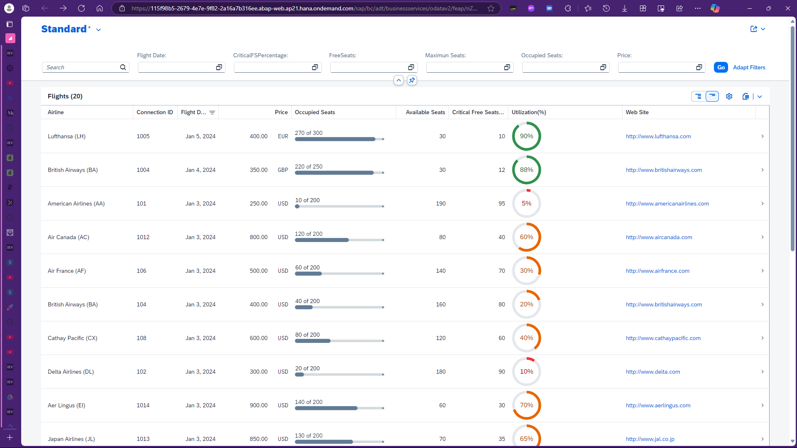
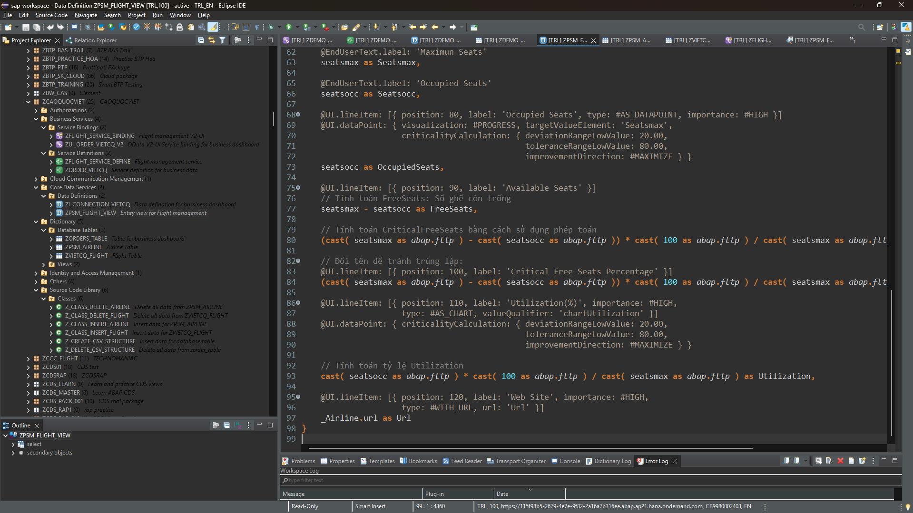

# abap-rap-flight-booking

ABAP RAP demo for flight management, featuring CDS Views, Fiori annotations, search, filters, and visualizations like charts and progress bars.

## Features

- **CDS Views**: Efficiently define and manage your data models.
- **Fiori Annotations**: Enhance the UI with rich annotations for better user experience.
- **Search and Filters**: Implement advanced search capabilities to filter flight data.
- **Visualizations**: Utilize charts and progress bars to represent flight utilization and seat availability.

## Development Workspace

The development workspace is set up in Visual Studio Code with integrated unit testing, an output pane, and a terminal for seamless development. Below is a snapshot of the workspace environment:

## Getting Started

### Prerequisites

- ABAP Development Tools (ADT)
- Access to an SAP system
- Git

### Installation

1. Clone the repository and navigate to the project directory.
2. Open the project in Visual Studio Code.
3. Set up the ABAP environment by importing the project and connecting to your SAP system.
4. Activate CDS Views and deploy Business Services.

## Usage

- **Create Database Tables**: Activate table definitions in the `Dictionary` directory.
- **Add/Delete Data**: Use the provided ABAP programs to insert or remove data from airline and flight tables.
- **Configure Views**: Set up DT definitions and configure CDS views for data representation.
- **Fiori Integration**: Add Service Definitions and Service Bindings to expose the views to Fiori web applications.

## License

MIT License